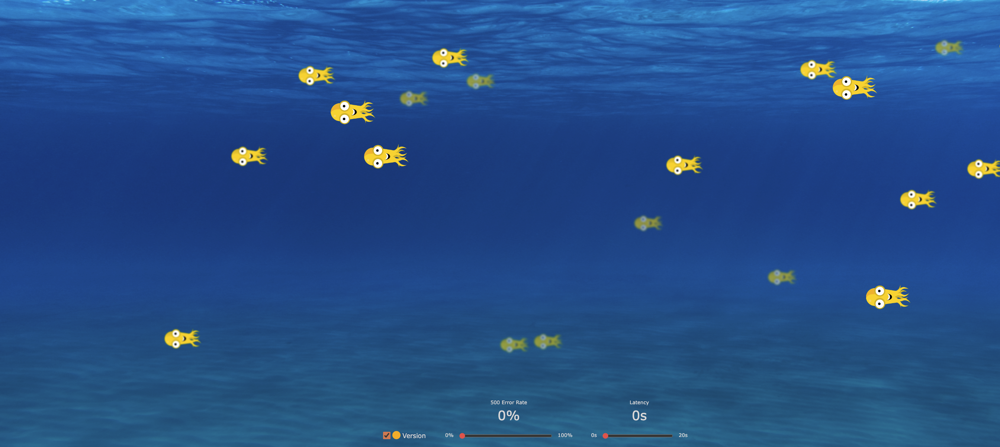

# Numalogic Demo Application

This repo contains the AIOPs based [Argo Rollouts](https://github.com/argoproj/argo-rollouts) demo application source code and examples. It demonstrates the
Anomaly score based canary  analysis deployment strategies and progressive delivery features of Argo Rollouts.



Before running an example:

To run an example:

1. Apply the manifests of one of the examples:

```bash
kustomize build ./manifests | kubectl apply -f -
```

2. Watch the rollout or experiment using the argo rollouts kubectl plugin:

```bash
kubectl argo rollouts get rollout <ROLLOUT-NAME> --watch
kubectl argo rollouts get experiment <EXPERIMENT-NAME> --watch
```

3. For rollouts, trigger an update by setting the image of a new color to run:
```bash
kubectl argo rollouts set image <ROLLOUT-NAME> "*=quay.io/numaio/numalogic-demo:puffy"
```

## Images

Available images fish are: octo, puffy, (e.g. `quay.io/numaio/numalogic-demo:octo`). Also available are:
* High error rate images, prefixed with the word `error` (e.g. `quay.io/numaio/numalogic-demo:puffyerror`)
* High latency images, prefixed with the word `slow` (e.g. `quay.io/numaio/numalogic-demo:puffylatency`)


## Releasing

To release new images:

```bash
make release IMAGE_NAMESPACE=argoproj DOCKER_PUSH=true
```
