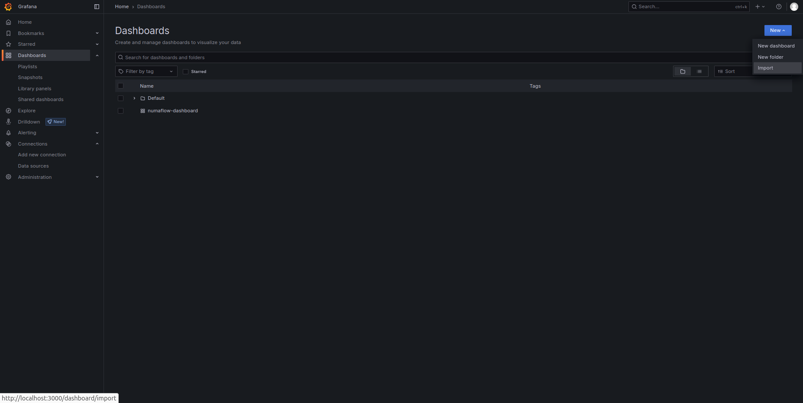
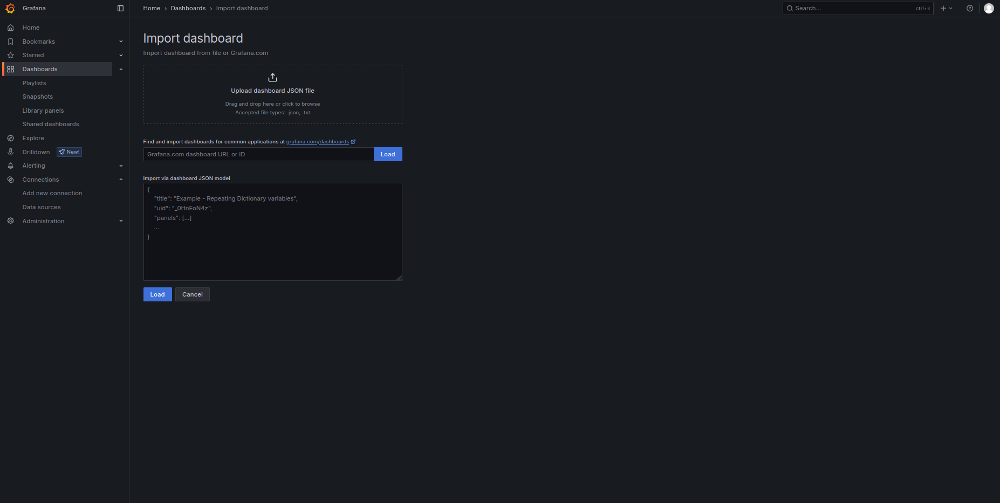
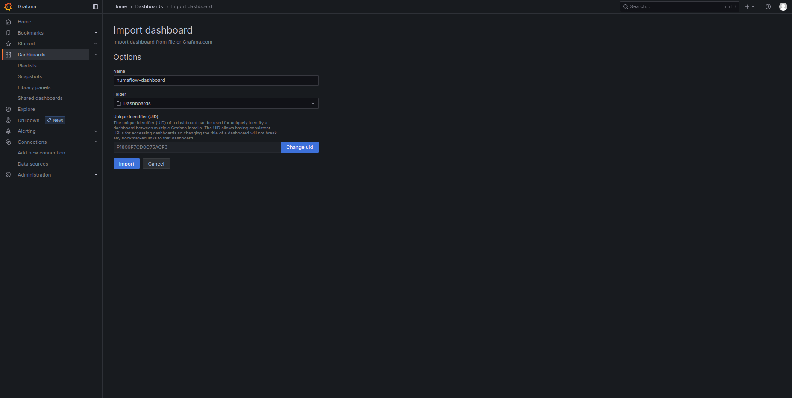
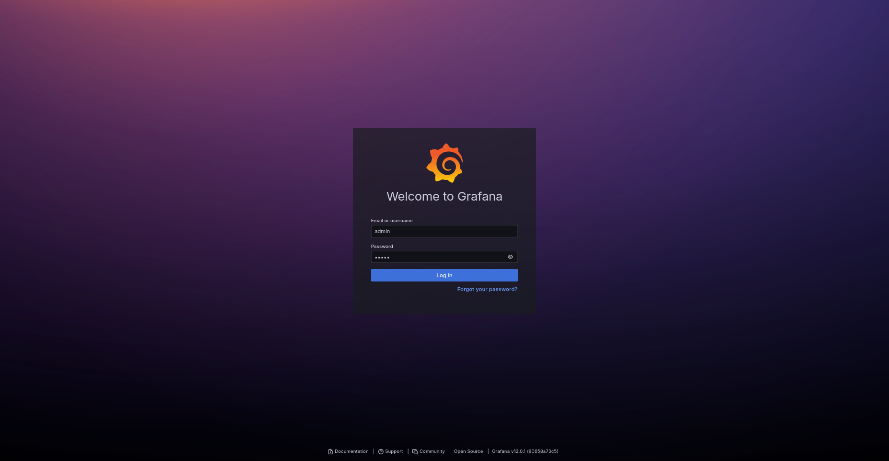
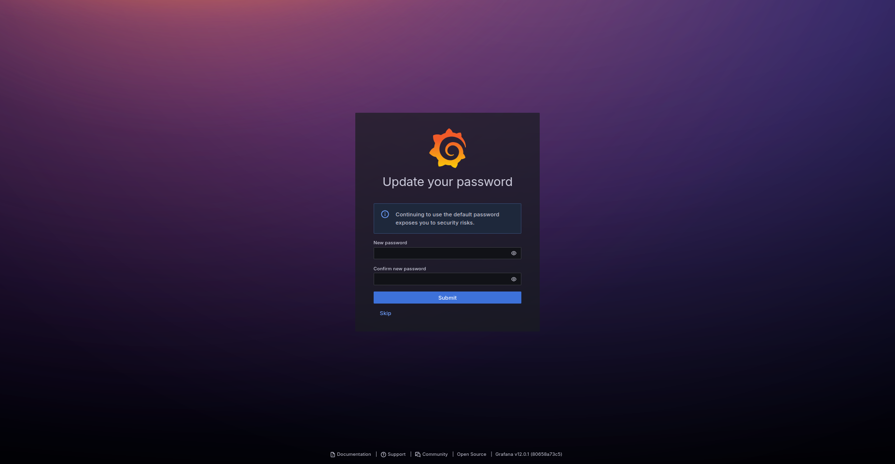
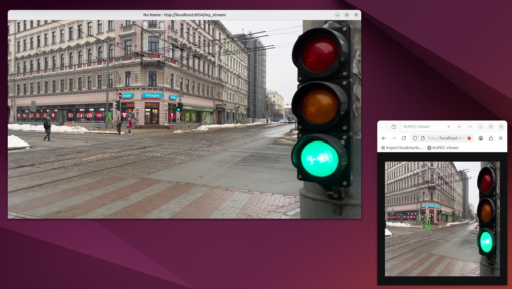
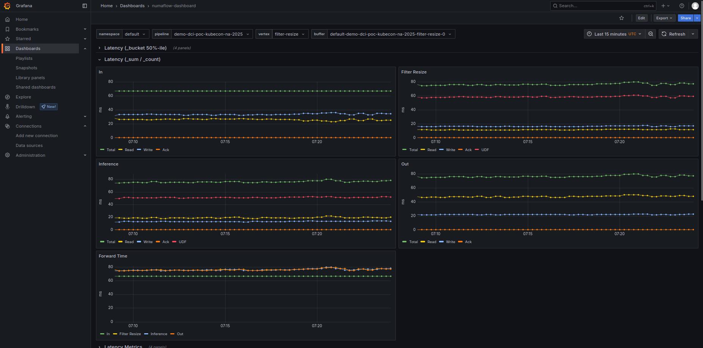
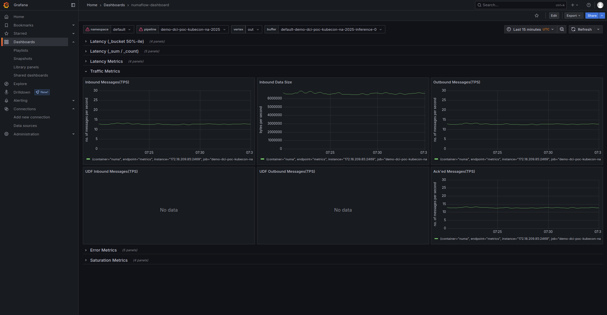

# Demo

This is a demonstration of a Numaflow pipeline with Kubernetes Dynamic Resource Allocation (DRA) feature. The pipeline continuously executes a video inference job that takes an input video from a streaming server, pre-processes frames, performs object detection, and outputs with bounding boxes.

The demo covers the following feature:

- Video streaming input via RTSP
- Pipeline switches to update accelerators or inference models
- Comparison of input and output videos
- Performance visualization of pipelines

Note that you should **follow README.md in the root directory before** starting installation of this demo.

# 1. Installation

## 1.1. SSH port-forwarding

SSH port-forwarding is required for performance visualization and remote desktop later.

Configure `~/.ssh/config` on your terminal as follows. Give an appropriate value for each placeholder:

```
Host YOUR_HOST
  Hostname      YOUR_HOSTNAME
  User          YOUR_USERNAME
  IdentityFile  ~/.ssh/id_YOUR_ID_FILE
  # Grafana
  LocalForward  3000 127.0.0.1:3000
  # VNC
  LocalForward  5900 127.0.0.1:5900
  LocalForward  5901 127.0.0.1:5901
```

## 1.2. Set up Performance visualization

### 1.2.1. Install Prometheus and Grafana by kube-prometheus

We collect and visualize performance metrics (latency and traffic) of our pipelines by Prometheus and Grafana.

On your control plane, follow the kube-prometheus official [quickstart guide](https://github.com/prometheus-operator/kube-prometheus/blob/main/README.md#quickstart) to install both of them.

If succeeded, the **grafana** service will run on the **monitoring** namespace.

```
$ kubectl get -n monitoring -l app.kubernetes.io/component=grafana service,deployment,replicaset,pod
NAME              TYPE        CLUSTER-IP     EXTERNAL-IP   PORT(S)    AGE
service/grafana   ClusterIP   10.43.226.86   <none>        3000/TCP   9d
NAME                      READY   UP-TO-DATE   AVAILABLE   AGE
deployment.apps/grafana   1/1     1            1           9d
NAME                                 DESIRED   CURRENT   READY   AGE
replicaset.apps/grafana-599bb4cc9d   1         1         1       9d
NAME                           READY   STATUS    RESTARTS   AGE
pod/grafana-599bb4cc9d-hznpf   1/1     Running   0          22h
```

### 1.2.2. Configure Service/Pod Monitors

Run `kubectl apply -f` for each of the two YAML files in the [&quot;Prometheus Operator for Scraping Metrics:&quot;](https://numaflow.numaproj.io/operations/metrics/metrics/#prometheus-operator-for-scraping-metrics) section in the Metrics page of the Numaflow official document.

### 1.2.3. Configure port-forwarding for Grafana's GUI & Login Grafana's GUI

You need to forward port 3000 to access Grafana's GUI. Run as follows in the `demo` directory to start `kubectl port-forward`.

```
$ ./01-forward-grafana.sh
```

Also, login your control plane from your terminal to start SSH port-forwarding and keep it until end of the section 1.2.4.

Now you can access the GUI via http://localhost:3000/ on your terminal through SSH port-forwarding.

For more details, please refer to "[2.3. Start port-forwarding Grafana's GUI](#23-start-port-forwarding-grafanas-gui)" and "[2.4. Login Grafana's GUI](#24-login-grafanas-gui)"

### 1.2.4. Import Grafana dashbord

Import our dashboard JSON file `demo/grafana-dashboard.json` to Grafana as follows:

1. Login Grafana as described on the first and second items in the section 2.4.
3. Click **Dashboards** on the left menu. You will see the Dashboards page.
4. Click **New** button -&gt; **Import** menu on your upper-right. You will see the &quot;Import dashboard&quot; page.
5. Click **&quot;Upload dashboard JSON file&quot;** to select `demo/grafana-dashboard.json`.
6. Click **Import** button.

Now you will see the **numaflow-dashboard** item on the Dashboards page.







## 1.3. Set up Remote desktop environment

It's more comfortable to operate and show our demo on your terminal remotely than on your control plane directly. Now remote desktop will help you.

We use x11vnc for remote desktop server due to acceleration support. The following instructions are also for x11vnc. However, you may use any remote desktop system you like.

### 1.3.1. Install graphical environment and remote desktop server

On your control plane, run as follows to install prerequisites:

```
$ sudo apt -y install ubuntu-desktop-minimal gdm3 x11vnc
```

Then run `systemctl get-default` to check if the output is `graphical.target`. If not so, run as follows then reboot:

```
$ sudo systemctl set-default graphical.target
```

### 1.3.2. Configure display manager

On your control plane, run `cat /etc/X11/default-display-manager` to check if the output (your display manager) is `/usr/sbin/gdm3`. If not so, run as follows then reboot:

```
$ sudo dpkg-reconfigure gdm3
```

In addition, edit `/etc/gdm3/custom.conf` as follows to disable Wayland:

```
# Uncomment the line below to force the login screen to use Xorg
WaylandEnable=false
```

### 1.3.3. Configure sudoers

You need to become `gdm` user at a certain place in our demo to run x11vnc for the greeter (login dialog).

On your control plane, edit your sudoers (`/etc/sudoers` or files under the `/etc/sudores.d` directory) as follows. Give the YOUR_USERNAME placeholder your username which runs the demo scripts.

```
YOUR_USERNAME ALL=(gdm) NOPASSWD: /usr/bin/x11vnc
```

### 1.3.4. Install remote desktop client

On your terminal, install remote desktop client you like.

On Ubuntu, you may install Remmina as follows:

```
$ sudo apt -y install remmina remmina-plugin-vnc
```

On macOS, you may install [RealVNC Viewer](https://www.realvnc.com/en/connect/download/viewer/macos/).

## 1.4. Configure Video Streaming Server

You already have [mediamtx](https://github.com/bluenviron/mediamtx) binary extracted from the official tarball in the `video-streaming-server/mediamtx` directory to run the Video Streaming Server on your control plane.

- `cp mediamtx.yml.template mediamtx.yml`
- Edit `mediamtx.yml` in that directory as follows. 
  - Give the `VIDEO_FILE_SRC` placeholder (not an environement variable) a relative path from the `video-streaming-server/mediamtx` directory or an absolute path to your video file. 
  - Note!: `VIDEO_FILE_SRC` should be the same that you configure in 2-7. of README.md to `VIDEO_FILE_SRC`. Be careful when using a relative path, as the starting point differ.
  - Note!: `$RTSP_PORT/$MTX_PATH` is iterally it.

```yaml
  my_stream:
    runOnDemand: >-
      ffmpeg -stream_loop -1 -re -i VIDEO_FILE_SRC
      -f mjpeg -q:v 0 -f rtsp rtsp://localhost:$RTSP_PORT/$MTX_PATH
    runOnDemandRestart: true
```

Also edit app.env as follows. Give each of the two `YOUR_CONTROL_PLANE_IP` placeholders the IP address of your control plane.

```
# SOURCE_INPUT_TYPE allows you to choose the input type.
# file, refer to VIDEO_FILE_SRC.
# stream, refer to VIDEO_STREAM_SRC.
SOURCE_INPUT_TYPE=stream

# VIDEO_FILE_SRC is The path where the video is located.
# When CI Test is executed, ${{ vars.PATH_PRE_DOWNLOADED_VIDEO }} is used
VIDEO_FILE_SRC=

# VIDEO_STREAM_SRC is the URL of the video stream.
# Default value is configured specifically for CI Test
VIDEO_STREAM_SRC='rtsp://YOUR_CONTROL_PLANE_IP:8554/my_stream'

RECEIVER_URL=http://YOUR_CONTROL_PLANE_IP:8000
```

## 1.5. Set up pipeline.yaml for demo
- `cp dci_poc/pipeline*.yaml demo/`
- In demo senario(3.6), you switch between pipelines that have the same name. you need to rename `metadata.name` to be same.

# 2. Daily setup of demo

Follow the subsections only once for each day of the demo.

## 2.1 Login control plane with SSH port-forwarding

Login from your terminal and keep your connection in order to port-forward Grafana and remote desktop. Do not forget `LocalForward` lines described in the section 1.1.

## 2.2. Check status of demo

Run `./00-stat-demo.sh` in the `demo` directory. You will see the 4 pods running as follows:

```
$ ./00-stat-demo.sh
+ main
+ ps -C x11vnc -C kubectl -C ffmpeg -C mediamtx -C screen -o ppid,pid,args
   PPID     PID COMMAND
+ :
+ kubectl get pod
NAME                             READY   STATUS    RESTARTS   AGE
isbsvc-default-js-0              3/3     Running   0          39d
isbsvc-default-js-1              3/3     Running   0          39d
isbsvc-default-js-2              3/3     Running   0          39d
local-static-provisioner-prxx2   1/1     Running   0          39d
+ exit 0
```

## 2.3. Start port-forwarding Grafana's GUI

Run as follows in the `demo` directory to port-forward Grafana.

```
$ ./01-forward-grafana.sh
```

Then run `./00-stat-demo.sh`. You will see `kubectl port-forward` and wrapping `SCREEN` processes running as follows (starred lines):

```
$ ./00-stat-demo.sh
+ main
+ ps -C x11vnc -C kubectl -C ffmpeg -C mediamtx -C screen -o ppid,pid,args
   PPID     PID COMMAND
      1  134278 SCREEN -d -m -- kubectl port-forward -n monitoring service/grafana 3000:3000 ⭐️
 134278  134280 kubectl port-forward -n monitoring service/grafana 3000:3000 ⭐️
+ kubectl get pod
NAME                             READY   STATUS    RESTARTS   AGE
isbsvc-default-js-0              3/3     Running   0          39d
isbsvc-default-js-1              3/3     Running   0          39d
isbsvc-default-js-2              3/3     Running   0          39d
local-static-provisioner-prxx2   1/1     Running   0          39d
+ exit 0
```

## 2.4. Login Grafana's GUI

1. Access Grafana's GUI via http://localhost:3000/ and give the username **admin** and the password **admin** to login.
2. **Skip** the &quot;Update Your Password&quot; dialog. You will see the Home page.
3. Click **Dashboards** on the left menu. You will see the Dashboards page.
4. Click the **numaflow-dashboard** item on the page.

Now you will see some rows on the dashboard. They will be used later.





## 2.5. Login remote desktop

### 2.5.1. Access remote greeter (login dialog)

On your control plane, run as follows in the `demo` directory to start x11vnc for the greeter. Do not forget the `-0` (hyphen zero) option.

```
$ ./02-start-x11vnc.sh -0
```

Then run `./00-stat-demo.sh`. You will see one `x11vnc` process running with `-rfbport 5900` as follows (starred line):

```
$ ./00-stat-demo.sh
+ main
+ ps -C x11vnc -C kubectl -C ffmpeg -C mediamtx -C screen -o ppid,pid,args
   PPID     PID COMMAND
      1  134278 SCREEN -d -m -- kubectl port-forward -n monitoring service/grafana 3000:3000
 134278  134280 kubectl port-forward -n monitoring service/grafana 3000:3000
 135830  135831 x11vnc -forever -nevershared -nopw -localhost -auth /run/user/126/gdm/Xauthority -rfbport 5900 -display :0 ⭐️
+ kubectl get pod
NAME                             READY   STATUS    RESTARTS   AGE
isbsvc-default-js-0              3/3     Running   0          39d
isbsvc-default-js-1              3/3     Running   0          39d
isbsvc-default-js-2              3/3     Running   0          39d
local-static-provisioner-prxx2   1/1     Running   0          39d
+ exit 0
```

Now access localhost:5900 from your terminal by your remote desktop client via VNC, then login with your username and password. After that, **your connection will be closed automatically,** but it's okay becuase it's the expected behavior.

### 2.5.2. Access remote desktop

On your control plane, run as follows in the `demo` directory to another x11vnc server for your desktop. Do not forget the `-1` (hyphen one) option.

```
$ ./02-start-x11vnc.sh -1
```

Then run `./00-stat-demo.sh`. You will see one `x11vnc` process running with `-rfbport 5901` as follows (starred line):

```
$ ./00-stat-demo.sh
+ main
+ ps -C x11vnc -C kubectl -C ffmpeg -C mediamtx -C screen -o ppid,pid,args
   PPID     PID COMMAND
      1  134278 SCREEN -d -m -- kubectl port-forward -n monitoring service/grafana 3000:3000
 134278  134280 kubectl port-forward -n monitoring service/grafana 3000:3000
      1  140914 x11vnc -forever -nevershared -nopw -localhost -auth /run/user/1000/gdm/Xauthority -rfbport 5901 -display :1.0 ⭐️
+ kubectl get pod
NAME                             READY   STATUS    RESTARTS   AGE
isbsvc-default-js-0              3/3     Running   0          39d
isbsvc-default-js-1              3/3     Running   0          39d
isbsvc-default-js-2              3/3     Running   0          39d
local-static-provisioner-prxx2   1/1     Running   0          39d
+ exit 0
```

Now access localhost:5901 from your terminal by your remote desktop client via VNC, then you will see your desktop.

### 2.5.3. Fix display resolution

The display resolution of your remote desktop may be small (typically 800x600).

To fix that, on **your remote desktop,** open a terminal app and run as follows in the `demo` directory:

```
$ ./03-fix-resolution.sh
```

# 3. Run demo

Follow the subsections once for each demo cycle. Unless otherwise specified, run each command in the `demo` directory on your control plane.

## 3.1. Start the Video Display Server

Run as follows to start the Video Display Server:

```
$ ./10-start-receiver.sh 
```

Then run `./00-stat-demo.sh`. You will see `make start-receiver` process wrapped by `SCREEN` running as follows (starred line):

```
$ ./00-stat-demo.sh 
+ main
+ ps -C x11vnc -C kubectl -C ffmpeg -C mediamtx -C screen -o ppid,pid,args
   PPID     PID COMMAND
      1  174179 SCREEN -d -m -- kubectl port-forward -n monitoring service/grafana 3000:3000
 174179  174181 kubectl port-forward -n monitoring service/grafana 3000:3000
      1  175941 x11vnc -forever -nevershared -nopw -localhost -auth /run/user/1000/gdm/Xauthority -rfbport 5901 -display :1.0
      1  176181 SCREEN -d -m -L -Logfile /home/ubuntu/git/numaflow-dra/demo/video-receive-server.log -- make start-receiver ⭐️
+ kubectl get pod
NAME                             READY   STATUS    RESTARTS   AGE
isbsvc-default-js-0              3/3     Running   0          46d
isbsvc-default-js-1              3/3     Running   0          46d
isbsvc-default-js-2              3/3     Running   0          46d
local-static-provisioner-prxx2   1/1     Running   0          46d
+ exit 0
```

## 3.2. Start the Video Streaming Server

Run as follows to start the Video Streaming Server:

```
$ ./11-start-mediamtx.sh
```

Then run `./00-stat-demo.sh`. You will see `./mediamtx` and its `SCREEN` wrapper processes running as follows (starred line):

```
$ ./00-stat-demo.sh 
+ main
+ ps -C x11vnc -C kubectl -C ffmpeg -C mediamtx -C screen -o ppid,pid,args
   PPID     PID COMMAND
      1  174179 SCREEN -d -m -- kubectl port-forward -n monitoring service/grafana 3000:3000
 174179  174181 kubectl port-forward -n monitoring service/grafana 3000:3000
      1  175941 x11vnc -forever -nevershared -nopw -localhost -auth /run/user/1000/gdm/Xauthority -rfbport 5901 -display :1.0
      1  176181 SCREEN -d -m -L -Logfile /home/ubuntu/git/numaflow-dra/demo/video-receive-server.log -- make start-receiver
      1  176646 SCREEN -d -m -L -Logfile /home/ubuntu/git/numaflow-dra/demo/mediamtx.log -- ./mediamtx ⭐️
 176646  176648 ./mediamtx ⭐️
+ kubectl get pod
NAME                             READY   STATUS    RESTARTS   AGE
isbsvc-default-js-0              3/3     Running   0          46d
isbsvc-default-js-1              3/3     Running   0          46d
isbsvc-default-js-2              3/3     Running   0          46d
local-static-provisioner-prxx2   1/1     Running   0          46d
+ exit 0
```

## 3.3. Deploy the first pipeline

Run as follows to deploy the first pipeline:

```
$ kubectl apply -f ../config_yaml/dra-t4.yml
$ kubectl apply -f ../demo/pipeline1.yaml
```

Then run `./00-stat-demo.sh`. You will see 5 additional pods running as follows (starred line):

```
$ ./00-stat-demo.sh 
+ main
+ ps -C x11vnc -C kubectl -C ffmpeg -C mediamtx -C screen -o ppid,pid,args
   PPID     PID COMMAND
      1  174179 SCREEN -d -m -- kubectl port-forward -n monitoring service/grafana 3000:3000
 174179  174181 kubectl port-forward -n monitoring service/grafana 3000:3000
      1  175941 x11vnc -forever -nevershared -nopw -localhost -auth /run/user/1000/gdm/Xauthority -rfbport 5901 -display :1.0
      1  176181 SCREEN -d -m -L -Logfile /home/ubuntu/git/numaflow-dra/demo/video-receive-server.log -- make start-receiver
      1  176646 SCREEN -d -m -L -Logfile /home/ubuntu/git/numaflow-dra/demo/mediamtx.log -- ./mediamtx
 176646  176648 ./mediamtx
 176648  177288 ffmpeg -stream_loop -1 -re -i ../6896028-uhd_3840_2160_15fps.mp4 -f mjpeg -q:v 0 -f rtsp rtsp://localhost:8554/my_stream
+ kubectl get pod
NAME                                                   READY   STATUS    RESTARTS   AGE
demo-dci-poc-kubecon-na-2025-daemon-65f7c79b8b-q9vm9   1/1     Running   0          62s ⭐️
demo-dci-poc-kubecon-na-2025-filter-resize-0-vesgl     3/3     Running   0          62s ⭐️
demo-dci-poc-kubecon-na-2025-in-0-jqpa1                3/3     Running   0          62s ⭐️
demo-dci-poc-kubecon-na-2025-inference-0-dvvdd         3/3     Running   0          62s ⭐️
demo-dci-poc-kubecon-na-2025-out-0-cvjod               3/3     Running   0          62s ⭐️
isbsvc-default-js-0                                    3/3     Running   0          46d
isbsvc-default-js-1                                    3/3     Running   0          46d
isbsvc-default-js-2                                    3/3     Running   0          46d
local-static-provisioner-prxx2                         1/1     Running   0          46d
+ exit 0
```

## 3.4. Play the input and output video streams

On your remote desktop, open a terminal app and run ffplay as follows to play the input video streamed by the Video Streaming Server:

```
$ ffplay -x 1280 -y 720 rtsp://localhost:8554/my_stream
```

In addition, open a web browser and access http://localhost:8000/viewer to play the output video arrived at the Video Display Server.



Note that it may be so slow to play both input and output videos in one desktop that the videos get fuzzy. In that case, close the ffplay window to stop playing the input video.

## 3.5. Visualize performance of pipeline

Before visualization, do the following on top of the dashboard:

- Choose the running pipeline name properly.
- Choose the **out** vertex to visualize the overall traffic of the pipeline.
- Choose **&quot;Last 15 minutes&quot;** or **&quot;Last 5 minutes&quot;** to visualize recent performance.

See the **Latency (\_sum / \_count)** row for average latency, and the **Traffic Metrics** row for traffic. Click the **Refresh** button on top-right of the dashboard periodically to show the current performance.

Assume that the frame rate of your input video is 15fps. We'd say the pipeline runs with good perfomance if the the Outbound Messages in the Traffic row is 15fps (same as the input rate) and the Total time for each vertex in the Latency row is 66.7ms (1s/15fps).





## 3.6. Switch pipelines

Run as follows to switch to the second pipeline and the third pipeline:

- By switching the deployment pipeline, you can easily change an accelerator used in the pipeline.
  - GPU used in the inference vertex switches from t4 to a100

```
$ kubectl apply -f ../demo/dra-a100.yml
$ kubectl apply -f ../demo/pipeline2.yaml
```

- When you update an ML inference model using Kubeflow, you can easily update the ML model used in the pipeline.
 - the inference model used in the inference vertex switches from yolov4 to yolov7

```
$ kubectl apply -f ../dci_poc/pipeline3.yaml
```

## 3.7. Stop playing video streams

Close the ffplay window (playing the input video) and the web browser (playing the output video).

## 3.8. Delete pipeline

Run as follows to delete the last-deployed pipeline. Give the placeholder PIPELINE_X_YAML the last-applied file in the section 3.3 and/or 3.6:

```
$ kubectl delete -f demo/PIPELINE_X_YAML
```

## 3.9. Terminate the Video Streaming Server

Run as follows to terminate the Video Streaming Server:

```
./80-stop-mediamtx.sh
```

## 3.10 Terminate the Video Display Server

Run as follows to terminate the Video Display Server:

```
./81-stop-receiver.sh
```

# 4. Daily teardown

## 4.1. Logout remote desktop

Logout remote desktop appropriately. Then run `./00-stat-demo.sh` on your control plane to check if there is no x11vnc process.

## 4.2. Stop port-forwarding Grafana's GUI

On your contorl plane, run `screen -r` to attach the screen process wrapping `kubectl port-forward` command, then type Ctrl-C to terminate the command.

## 4.3. Logout control plane

Exit from your control plane.
